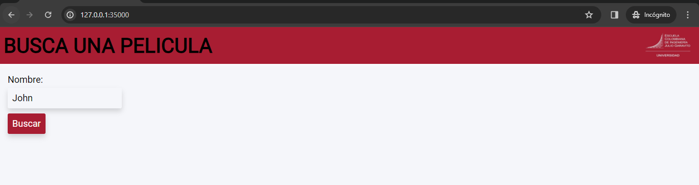

# TALLER 2: DISEÑO Y ESTRUCTURACIÓN DE APLICACIONES DISTRIBUIDAS EN INTERNET

#### Hecho por: Daniel Santiago Gómez Zabala

Se construyó una app que consulta peliculas para poner a prueba el servidor web teniendo en cuenta la comunicación REST requerida para el taller.

## GETTING STARTED

1. Debe tener instalado Maven en su computador para poder ejecutar los comandos que se le indicarán más adelante.
2. Debe contar con GITHUB para poder hacer uso del repositorio donde se alberga el laboratorio.
3. Debe tener un ambiente de java para poder visualizar y ejecutar el codigo.

## INSTALLING 

Debe clonar el respositorio para poder hacer uso de la app con el comando que se encuentra a continuación

```
https://github.com/sagomezab/Taller2_AREP.git
```

Para hacer uso de la aplicación debe dirigirse desde la consola a la carpeta *TALLER2_AREP* la cual alberga el taller, para ejecutarlo será necesario que ejecute el siguiente comando:

```
mvn exec:java
```

Después será necesario dirigirnos a nuestro navegador de preferencia y coloca en el browser lo siguiente:

```
http://127.0.0.1:35000/
```
Se visualizará lo siguiente:




## Built With

* [Maven](https://maven.apache.org/) - Administrador de dependencias

## Version

3.0

## Author

Daniel Santiago Gómez Zabala [SAGOMEZAB](https://github.com/sagomezab)

## Acknowledgments

El proyecto incluye una clase llamada HttpServer, que actúa como fachada de un servidor web y expone servicios para ser consumidos por clientes. Esta clase también incorpora mecanismos para manejar diversas solicitudes realizadas por los clientes, así como un caché resistente a la concurrencia. En este caché se almacenan todas las peticiones realizadas al API externo, con el objetivo de minimizar el tiempo y el consumo de recursos en futuras solicitudes.

Adicionalmente, se han implementado servicios REST para gestionar las distintas solicitudes de recursos HTML, CSS, JavaScript e imágenes de la página. Esta estructura hace que el servidor sea más potente y facilita la adición de nuevos servicios mediante la simple inclusión de instrucciones en el bloque principal de la clase WebApp.


